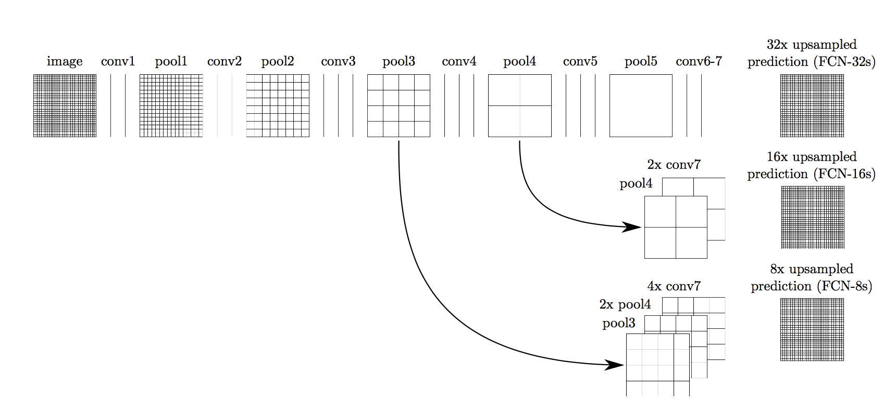

# Semantic Segmentation
### Introduction
In this project, you'll label the pixels of a road in images using a Fully Convolutional Network (FCN).

## Model Documentation
This model is based on the walkthrough video. Vgg-layer3 and 4 are added to the docode of Vgg-layer7.
These are the same as "FCN-8 Encoder/FCN-9 Decoder" in the lesson.

~~~
vgg_layer7_1x1 = tf.layers.conv2d(vgg_layer7_out, num_classes, 1, padding='same') 
trans1 = tf.layers.conv2d_transpose(vgg_layer7_1x1, num_classes, 4, 2, padding='same') 
vgg_layer4_1x1 = tf.layers.conv2d(vgg_layer4_out, num_classes, 1, padding='same')
skip1 = tf.add(trans2, vgg_layer4_1x1)
trans2 = tf.layers.conv2d_transpose(skip1, num_classes, 4, 2, padding='same')
vgg_layer3_1x1 = tf.layers.conv2d(vgg_layer3_out, num_classes, 1, padding='same')
skip2 = tf.add(trans2, vgg_layer3_1x1)
output = tf.layers.conv2d_transpose(skip2, num_classes, 16, 8, padding='same')
~~~~



~~~

The Optimization is as follows. This is the same as "FCN-8 Classfication & Loss".
 
~~~
logits = tf.reshape(nn_last_layer, (-1, num_classes))
cross_entropy_loss = tf.reduce_mean(tf.nn.softmax_cross_entropy_with_logits(logits=logits, labels=correct_label))
optimizer = tf.train.AdamOptimizer(learning_rate).minimize(cross_entropy_loss)
~~~

The more batches are, the more efficient it is, but because the memory becomes insufficient, batch is set to 10.
In addition, if it is 30 epoch, learning will be insufficient and it is set to 100.

### Setup
##### Frameworks and Packages
Make sure you have the following is installed:
 - [Python 3](https://www.python.org/)
 - [TensorFlow](https://www.tensorflow.org/)
 - [NumPy](http://www.numpy.org/)
 - [SciPy](https://www.scipy.org/)
##### Dataset
Download the [Kitti Road dataset](http://www.cvlibs.net/datasets/kitti/eval_road.php) from [here](http://www.cvlibs.net/download.php?file=data_road.zip).  Extract the dataset in the `data` folder.  This will create the folder `data_road` with all the training a test images.

### Start
##### Implement
Implement the code in the `main.py` module indicated by the "TODO" comments.
The comments indicated with "OPTIONAL" tag are not required to complete.
##### Run
Run the following command to run the project:
```
python main.py
```
**Note** If running this in Jupyter Notebook system messages, such as those regarding test status, may appear in the terminal rather than the notebook.

### Submission
1. Ensure you've passed all the unit tests.
2. Ensure you pass all points on [the rubric](https://review.udacity.com/#!/rubrics/989/view).
3. Submit the following in a zip file.
 - `helper.py`
 - `main.py`
 - `project_tests.py`
 - Newest inference images from `runs` folder
 
 ## How to write a README
A well written README file can enhance your project and portfolio.  Develop your abilities to create professional README files by completing [this free course](https://www.udacity.com/course/writing-readmes--ud777).
